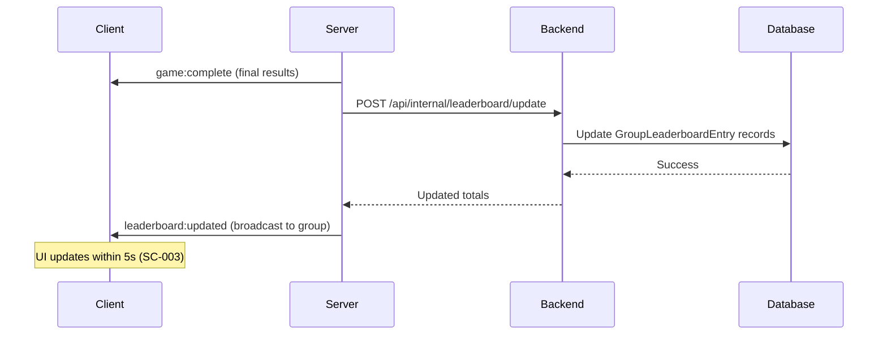
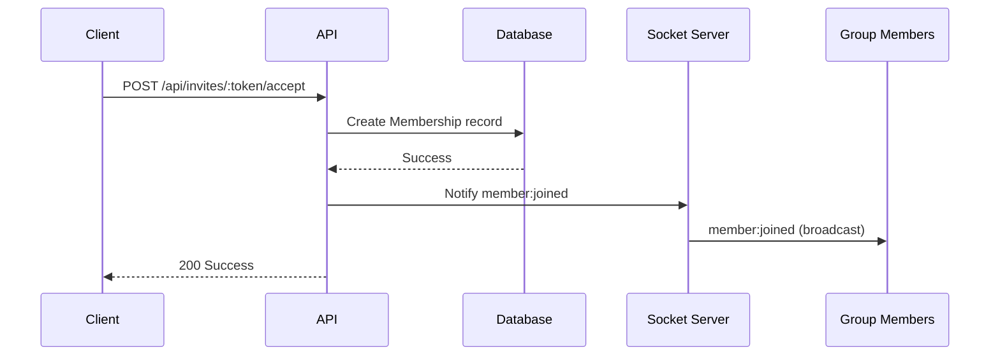

# Socket.IO Event Contracts

**Feature**: Authentication, Groups, and Persistent Leaderboards  
**Generated**: 2025-11-02  
**Transport**: WebSocket (Socket.IO v4)

## Overview

This document defines the Socket.IO events required for real-time group leaderboard updates and room management. All events use Socket.IO namespaces and rooms for efficient message routing.

## Connection & Authentication

### Client Connection

Clients connect to the Socket.IO server with a Clerk session token for authenticated features:

```javascript
import { io } from 'socket.io-client';

const socket = io('http://localhost:3001', {
  auth: {
    token: clerkSessionToken // Optional for guests, required for group features
  }
});
```

### Server Authentication

The server validates the token on connection and attaches user context:

```javascript
io.use((socket, next) => {
  const token = socket.handshake.auth.token;
  if (token) {
    // Validate with Clerk, attach userId to socket
    socket.data.userId = verifiedUserId;
  }
  next();
});
```

**Error Events**:
- `error`: Emitted when authentication fails or connection is rejected

```javascript
socket.on('error', (error) => {
  console.error('Socket error:', error.message);
});
```

---

## Namespace: `/` (Default)

### Room Management Events (Existing + Extended)

#### `room:create`

**Purpose**: Create a new trivia room (extended to support group affiliation - FR-005)

**Direction**: Client → Server

**Payload**:
```javascript
{
  hostName: 'Alice Smith',      // Required if not authenticated
  groupId: 'grp_abc123',        // Optional, requires authentication and membership
  maxPlayers: 10,               // Optional, default 10
  roundCount: 5                 // Optional, default 5
}
```

**Server Response**: `room:created`

**Payload**:
```javascript
{
  code: 'ABCD12',
  hostName: 'Alice Smith',
  groupId: 'grp_abc123',        // Present if group-affiliated
  groupName: 'Team Trivia Champions', // Present if group-affiliated
  maxPlayers: 10,
  roundCount: 5,
  status: 'WAITING',
  participants: []
}
```

**Error Response**: `room:error`

**Payload**:
```javascript
{
  code: 'FORBIDDEN',
  message: 'User is not a member of the specified group'
}
```

**Related Requirements**: FR-005 (create group room), FR-014 (choose group)

---

#### `room:join`

**Purpose**: Join an existing room (extended to include membership check for group rooms - FR-007)

**Direction**: Client → Server

**Payload**:
```javascript
{
  code: 'ABCD12',
  playerName: 'Bob Jones'  // Required if not authenticated
}
```

**Server Response**: `room:joined`

**Payload**:
```javascript
{
  code: 'ABCD12',
  participant: {
    id: 'user_3def456',       // userId if authenticated, socketId if guest
    name: 'Bob Jones',
    isGuest: false,
    isGroupMember: true       // Present if room is group-affiliated
  },
  room: {
    code: 'ABCD12',
    hostName: 'Alice Smith',
    groupId: 'grp_abc123',
    groupName: 'Team Trivia Champions',
    status: 'WAITING',
    participants: [
      { id: 'user_2abc123', name: 'Alice Smith', isGuest: false, isGroupMember: true },
      { id: 'user_3def456', name: 'Bob Jones', isGuest: false, isGroupMember: true }
    ]
  }
}
```

**Broadcast to Room**: `participant:joined`

**Payload** (to other participants):
```javascript
{
  participant: {
    id: 'user_3def456',
    name: 'Bob Jones',
    isGuest: false,
    isGroupMember: true
  }
}
```

**Error Response**: `room:error`

**Payload**:
```javascript
{
  code: 'NOT_FOUND',
  message: 'Room ABCD12 does not exist'
}
```

**Related Requirements**: FR-007 (identify non-members)

---

#### `room:leave`

**Purpose**: Leave the current room

**Direction**: Client → Server

**Payload**:
```javascript
{
  code: 'ABCD12'
}
```

**Server Response**: `room:left`

**Broadcast to Room**: `participant:left`

**Payload**:
```javascript
{
  participantId: 'user_3def456',
  participantName: 'Bob Jones'
}
```

---

### Game Flow Events (Existing)

#### `game:start`

**Purpose**: Host starts the game

**Direction**: Client → Server

**Payload**:
```javascript
{
  code: 'ABCD12'
}
```

**Broadcast to Room**: `game:started`

**Payload**:
```javascript
{
  round: 1,
  totalRounds: 5,
  countdown: 3  // Countdown seconds before first question
}
```

---

#### `game:nextQuestion`

**Purpose**: Broadcast the next question to all participants

**Direction**: Server → Clients (broadcast)

**Payload**:
```javascript
{
  round: 1,
  question: {
    id: 'q_123',
    text: 'What is the capital of France?',
    options: ['London', 'Berlin', 'Paris', 'Madrid'],
    timeLimit: 15  // seconds
  }
}
```

---

#### `game:answer`

**Purpose**: Submit answer for the current question

**Direction**: Client → Server

**Payload**:
```javascript
{
  code: 'ABCD12',
  questionId: 'q_123',
  answer: 2,  // Index of selected option
  timeElapsed: 8.5  // seconds
}
```

**Server Response**: `game:answerReceived`

**Payload**:
```javascript
{
  questionId: 'q_123',
  isCorrect: true,
  points: 10
}
```

---

#### `game:roundComplete`

**Purpose**: Notify participants that a round has completed

**Direction**: Server → Clients (broadcast)

**Payload**:
```javascript
{
  round: 1,
  results: [
    { id: 'user_2abc123', name: 'Alice Smith', points: 10, isGroupMember: true },
    { id: 'user_3def456', name: 'Bob Jones', points: 8, isGroupMember: true },
    { id: 'socket_xyz', name: 'Guest123', points: 6, isGroupMember: false }
  ],
  nextRound: 2,
  countdown: 5  // Seconds until next round
}
```

**Related Requirements**: FR-006 (identify member points), FR-007 (identify non-member points)

---

#### `game:complete`

**Purpose**: Notify participants that the game has ended and trigger leaderboard update (FR-009)

**Direction**: Server → Clients (broadcast)

**Payload**:
```javascript
{
  finalResults: [
    {
      id: 'user_2abc123',
      name: 'Alice Smith',
      totalPoints: 85,
      isGroupMember: true,
      rank: 1
    },
    {
      id: 'user_3def456',
      name: 'Bob Jones',
      totalPoints: 70,
      isGroupMember: true,
      rank: 2
    },
    {
      id: 'socket_xyz',
      name: 'Guest123',
      totalPoints: 60,
      isGroupMember: false,
      rank: 3
    }
  ],
  groupId: 'grp_abc123',  // Present if group-affiliated
  roomCode: 'ABCD12'
}
```

**Server Action**: If `groupId` is present, call internal leaderboard update endpoint

**Related Requirements**: FR-006 (attribute member points), FR-007 (exclude non-member points), FR-009 (trigger update)

---

## Namespace: `/groups` (New)

### Group-Specific Events

#### `group:subscribe`

**Purpose**: Subscribe to real-time updates for a specific group (leaderboard changes, new members)

**Direction**: Client → Server

**Payload**:
```javascript
{
  groupId: 'grp_abc123'
}
```

**Server Response**: `group:subscribed`

**Payload**:
```javascript
{
  groupId: 'grp_abc123',
  groupName: 'Team Trivia Champions'
}
```

**Error Response**: `group:error`

**Payload**:
```javascript
{
  code: 'FORBIDDEN',
  message: 'User is not a member of this group'
}
```

**Related Requirements**: FR-009 (real-time leaderboard updates)

---

#### `group:unsubscribe`

**Purpose**: Unsubscribe from group updates

**Direction**: Client → Server

**Payload**:
```javascript
{
  groupId: 'grp_abc123'
}
```

**Server Response**: `group:unsubscribed`

---

#### `leaderboard:updated`

**Purpose**: Broadcast leaderboard changes to subscribed group members (FR-009)

**Direction**: Server → Clients (broadcast to group room)

**Trigger**: Emitted after internal leaderboard update endpoint completes (after `game:complete`)

**Payload**:
```javascript
{
  groupId: 'grp_abc123',
  timestamp: '2025-11-03T09:30:00.000Z',
  updates: [
    {
      userId: 'user_2abc123',
      displayName: 'Alice Smith',
      newTotal: 450,
      pointsAdded: 85,
      newRank: 1,
      previousRank: 1
    },
    {
      userId: 'user_3def456',
      displayName: 'Bob Jones',
      newTotal: 380,
      pointsAdded: 70,
      newRank: 2,
      previousRank: 2
    }
  ],
  topThree: [
    { userId: 'user_2abc123', displayName: 'Alice Smith', totalPoints: 450 },
    { userId: 'user_3def456', displayName: 'Bob Jones', totalPoints: 380 },
    { userId: 'user_4ghi789', displayName: 'Carol Lee', totalPoints: 350 }
  ]
}
```

**Client Handling**: Update UI to reflect new totals without full page refresh

**Related Requirements**: FR-009 (prompt updates within 5s), SC-003 (<5s leaderboard updates)

---

#### `member:joined`

**Purpose**: Notify group members when someone joins via invite

**Direction**: Server → Clients (broadcast to group room)

**Trigger**: Emitted after successful invite acceptance (POST /api/invites/:token/accept)

**Payload**:
```javascript
{
  groupId: 'grp_abc123',
  member: {
    userId: 'user_5jkl012',
    displayName: 'David Kim',
    avatarUrl: 'https://img.clerk.com/...',
    role: 'MEMBER',
    joinedAt: '2025-11-03T10:00:00.000Z'
  }
}
```

---

#### `member:left`

**Purpose**: Notify group members when someone leaves

**Direction**: Server → Clients (broadcast to group room)

**Trigger**: Emitted after POST /api/groups/:groupId/leave

**Payload**:
```javascript
{
  groupId: 'grp_abc123',
  member: {
    userId: 'user_5jkl012',
    displayName: 'David Kim'
  },
  reason: 'left'  // 'left' or 'removed'
}
```

---

#### `member:removed`

**Purpose**: Notify group members when an admin removes someone

**Direction**: Server → Clients (broadcast to group room)

**Trigger**: Emitted after POST /api/groups/:groupId/members/:userId/remove

**Payload**:
```javascript
{
  groupId: 'grp_abc123',
  member: {
    userId: 'user_5jkl012',
    displayName: 'David Kim'
  },
  removedBy: {
    userId: 'user_2abc123',
    displayName: 'Alice Smith'
  },
  reason: 'removed'
}
```

---

#### `member:promoted`

**Purpose**: Notify group members when someone is promoted to admin

**Direction**: Server → Clients (broadcast to group room)

**Trigger**: Emitted after POST /api/groups/:groupId/members/:userId/promote

**Payload**:
```javascript
{
  groupId: 'grp_abc123',
  member: {
    userId: 'user_3def456',
    displayName: 'Bob Jones',
    newRole: 'ADMIN'
  },
  promotedBy: {
    userId: 'user_2abc123',
    displayName: 'Alice Smith'
  }
}
```

---

## Error Handling

All Socket.IO errors follow this format:

```javascript
{
  code: 'ERROR_CODE',
  message: 'Human-readable error message',
  details: {}  // Optional additional context
}
```

Common error codes:
- `UNAUTHORIZED`: Missing or invalid authentication token
- `FORBIDDEN`: Authenticated but lacks permission
- `NOT_FOUND`: Requested resource does not exist
- `VALIDATION_ERROR`: Invalid event payload
- `ROOM_FULL`: Cannot join room (max players reached)
- `GAME_IN_PROGRESS`: Cannot perform action during active game

---

## Reconnection Handling

Clients should implement reconnection logic with exponential backoff:

```javascript
socket.on('disconnect', (reason) => {
  if (reason === 'io server disconnect') {
    // Server forcibly disconnected, manual reconnect required
    socket.connect();
  }
  // Socket.IO auto-reconnects for other disconnect reasons
});

socket.on('connect', () => {
  // Re-subscribe to groups after reconnection
  socket.emit('group:subscribe', { groupId: 'grp_abc123' });
});
```

---

## Performance Considerations

1. **Room Subscriptions**: Clients should only subscribe to groups they're actively viewing to reduce server load.

2. **Leaderboard Updates**: Server batches updates from the same game completion event to emit a single `leaderboard:updated` event per group.

3. **Broadcast Optimization**: Events use Socket.IO rooms (`socket.join(groupId)`) to limit broadcasts to relevant clients only.

4. **Heartbeat**: Socket.IO ping/pong mechanism ensures connection health (default 25s interval).

5. **Message Size**: Keep payloads under 16KB for optimal performance. Leaderboard updates only include top 3 and changed entries, not full leaderboard.

---

## Integration Flow

### Game Completion → Leaderboard Update



### Invite Acceptance → Member Notification



---

## Notes

1. **Authentication**: Guests can connect without a token for anonymous play. Group-specific events (`/groups` namespace) require authentication.

2. **Group Rooms**: Each group gets a dedicated Socket.IO room (`groupId`) for efficient broadcasting of leaderboard updates and member changes.

3. **Member Identification**: The `isGroupMember` flag in game events helps clients distinguish between members (whose points affect the leaderboard) and guests (whose points do not).

4. **Real-Time Guarantee**: SC-003 requires leaderboard updates within 5s. The flow ensures the `leaderboard:updated` event is emitted immediately after database update completes.

5. **Graceful Degradation**: If WebSocket connection fails, clients should fall back to HTTP polling (GET /api/groups/:groupId/leaderboard) with a 5-10s interval.

6. **Session Recovery**: Socket.IO maintains connection state. If a client disconnects during a game, they can rejoin the room using the same `room:join` event.

7. **Rate Limiting**: Not applied to Socket.IO events, but server monitors for abusive patterns (e.g., rapid room creation via `room:create`).
