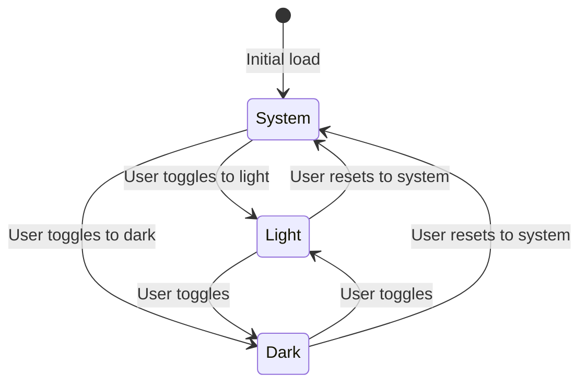

# Data Model: UI Redesign with Dark Mode

**Feature**: 004-ui-redesign-dark-mode  
**Date**: November 5, 2025  
**Status**: Complete

## Overview

This feature is primarily UI/frontend-focused with minimal data persistence requirements. The only data entity is the theme preference, managed automatically by the next-themes library and stored client-side in browser localStorage.

---

## Entity: Theme Preference

### Storage Location
- **Medium**: Browser localStorage (managed by next-themes)
- **Key**: `theme` (default next-themes key)
- **Scope**: Per-device, per-browser (not synced across devices)
- **Lifetime**: Persistent until user clears browser data

### Schema

```typescript
// next-themes manages this internally
type Theme = 'light' | 'dark' | 'system';
```

### Storage Format

**localStorage Value** (managed by next-themes):
```
"dark"  // Simple string value
```

or

```
"light"
```

or

```
"system"  // Respects OS preference
```

**Note**: next-themes automatically handles the localStorage key-value pair. You don't need to manually manage this.

### Field Definitions

| Field | Type | Required | Default | Description |
|-------|------|----------|---------|-------------|
| `theme` | `'light' \| 'dark' \| 'system'` | No | `'system'` | User's theme preference (managed by next-themes) |

### Validation Rules

1. **theme**: Must be one of: `'light'`, `'dark'`, `'system'`
2. **Fallback**: If invalid/missing, defaults to `'system'` (handled by next-themes)
3. **Error handling**: next-themes handles localStorage errors gracefully

### State Transitions



**Transition Triggers**:
- User clicks theme toggle button
- User changes system preference (automatic detection)
- User clears localStorage (reset to system)

### Computed State

The actual applied theme is computed by next-themes from:
1. User preference (`theme`)
2. System preference (`window.matchMedia('(prefers-color-scheme: dark)')`)

**Resolution Logic** (handled automatically by next-themes):
```typescript
// next-themes does this internally
function resolveTheme(preference: Theme): 'light' | 'dark' {
  if (preference === 'system') {
    return window.matchMedia('(prefers-color-scheme: dark)').matches 
      ? 'dark' 
      : 'light';
  }
  return preference;
}

// Access resolved theme via hook
const { theme, resolvedTheme } = useTheme();
// theme: 'light' | 'dark' | 'system' (user's choice)
// resolvedTheme: 'light' | 'dark' (actual applied theme)
```

---

## Entity: Landing Page Content

### Storage Location
- **Medium**: Static content (hardcoded in components)
- **Future**: Could be moved to CMS, but not in this scope

### Schema

```typescript
interface HeroContent {
  title: string;
  tagline: string;
  primaryCTA: {
    text: string;
    action: string; // Route or handler
  };
  secondaryCTA: {
    text: string;
    action: string;
  };
}

interface Feature {
  id: string;
  icon: string; // lucide-react icon name
  title: string;
  description: string;
}

interface LandingPageContent {
  hero: HeroContent;
  features: Feature[];
}
```

### Example Content

```typescript
const landingContent: LandingPageContent = {
  hero: {
    title: "Real-Time Trivia Competitions",
    tagline: "Create rooms, invite friends, and compete in real-time trivia battles. No signup required.",
    primaryCTA: {
      text: "Create Room",
      action: "/room/create"
    },
    secondaryCTA: {
      text: "Join Room",
      action: "/room/join"
    }
  },
  features: [
    {
      id: "real-time",
      icon: "Zap",
      title: "Real-time Gameplay",
      description: "Instant synchronization with Socket.IO. See answers as they happen."
    },
    {
      id: "groups",
      icon: "Users",
      title: "Group Competitions",
      description: "Compete with friends or join public rooms. Track leaderboards and stats."
    },
    {
      id: "quick",
      icon: "Clock",
      title: "Quick Room Creation",
      description: "Start a game in seconds. Share a simple room code with friends."
    },
    {
      id: "no-signup",
      icon: "ShieldCheck",
      title: "No Registration Required",
      description: "Jump in and play immediately. Optional authentication for groups."
    }
  ]
};
```

---

## Entity: Design Tokens

### Storage Location
- **Medium**: CSS variables in `globals.css`
- **Access**: Via Tailwind CSS utilities

### Schema

```typescript
interface DesignTokens {
  colors: {
    light: ColorPalette;
    dark: ColorPalette;
  };
  typography: {
    sans: string;
    serif: string;
    mono: string;
  };
  radius: {
    sm: string;
    md: string;
    lg: string;
    xl: string;
  };
  shadows: {
    '2xs': string;
    'xs': string;
    'sm': string;
    'md': string;
    'lg': string;
    'xl': string;
    '2xl': string;
  };
  spacing: string;
}

interface ColorPalette {
  background: string;
  foreground: string;
  card: string;
  cardForeground: string;
  popover: string;
  popoverForeground: string;
  primary: string;
  primaryForeground: string;
  secondary: string;
  secondaryForeground: string;
  muted: string;
  mutedForeground: string;
  accent: string;
  accentForeground: string;
  destructive: string;
  destructiveForeground: string;
  border: string;
  input: string;
  ring: string;
  // ... chart colors, sidebar colors
}
```

### CSS Variable Mapping

All design tokens map to CSS custom properties:
```css
:root {
  --background: oklch(1.0000 0 0);
  --foreground: oklch(0.2686 0 0);
  /* ... */
}

.dark {
  --background: oklch(0.2046 0 0);
  --foreground: oklch(0.9219 0 0);
  /* ... */
}
```

Accessed via Tailwind:
```tsx
<div className="bg-background text-foreground">
  <Button className="bg-primary text-primary-foreground">
    Click me
  </Button>
</div>
```

---

## Data Flow Diagram

```
┌─────────────────────────────────────────────────┐
│                 User Actions                     │
└───────────────────┬─────────────────────────────┘
                    │
                    ▼
        ┌───────────────────────┐
        │  Theme Toggle Click   │
        └───────────┬───────────┘
                    │
                    ▼
        ┌───────────────────────┐
        │   ThemeProvider       │
        │   (React Context)     │
        └───────────┬───────────┘
                    │
          ┌─────────┴─────────┐
          │                   │
          ▼                   ▼
  ┌───────────────┐   ┌──────────────┐
  │ localStorage  │   │ Apply to DOM │
  │   (persist)   │   │ <html class> │
  └───────────────┘   └──────┬───────┘
                             │
                             ▼
                    ┌─────────────────┐
                    │  CSS Variables  │
                    │  (globals.css)  │
                    └─────────┬───────┘
                              │
                              ▼
                    ┌─────────────────┐
                    │  All Components │
                    │  Re-render with │
                    │  New Theme      │
                    └─────────────────┘
```

---

## Migration Notes

### Existing Data
- No existing theme preference data (new feature)
- No migration required

### Backward Compatibility
- If localStorage contains legacy format (simple string), parse correctly
- If no theme preference found, default to `'system'`
- No breaking changes to existing data structures

### Data Cleanup
- No cleanup required
- Optional: Add TTL to theme preference (e.g., expire after 90 days of inactivity)
  - Not implemented in initial version

---

## Privacy & Security

### Data Sensitivity
- **Theme preference**: Non-sensitive, low privacy concern
- **No PII**: No personally identifiable information stored
- **No tracking**: Theme preference not sent to backend

### Security Considerations
- localStorage is origin-scoped (no cross-origin access)
- No XSS risk (theme value validated before use)
- No CSRF risk (client-side only, no server mutations)

### GDPR Compliance
- Theme preference is functional storage (exempt from consent requirements)
- No analytics or tracking cookies
- User can clear preference via browser settings

---

## Performance Characteristics

### Storage Access
- **Read frequency**: Once per page load + system preference changes
- **Write frequency**: Only on user toggle action
- **Size**: <100 bytes (negligible)
- **Latency**: <1ms (synchronous localStorage access)

### Memory Footprint
- **Context state**: <1KB in memory
- **Event listeners**: 1 listener for `prefers-color-scheme` changes
- **No memory leaks**: Cleanup in useEffect unmount

---

## Testing Scenarios

### Happy Path
1. User lands on site → System preference detected → Theme applied
2. User toggles theme → Preference saved → Theme updates instantly
3. User refreshes page → Preference loaded → Theme persists

### Edge Cases
1. localStorage disabled/blocked → Fallback to system preference, no error
2. Invalid preference value → Sanitize to `'system'`
3. System preference changes while app open → Auto-detect and update if mode is `'system'`
4. Rapid theme toggling → Debounce not needed (instant updates acceptable)

### Error Handling
```typescript
function loadThemePreference(): ThemeMode {
  try {
    const stored = localStorage.getItem('theme-preference');
    if (!stored) return 'system';
    
    // Handle legacy string format
    if (stored === 'light' || stored === 'dark') return stored;
    
    // Handle JSON object format
    const parsed = JSON.parse(stored);
    if (parsed.mode && ['light', 'dark', 'system'].includes(parsed.mode)) {
      return parsed.mode;
    }
    
    return 'system';
  } catch (error) {
    console.warn('Failed to load theme preference:', error);
    return 'system';
  }
}
```

---

## Conclusion

Data model is minimal and straightforward:
- **Primary entity**: Theme preference (localStorage)
- **Static content**: Landing page copy (hardcoded)
- **Design tokens**: CSS variables (globals.css)

No database schema changes, no API contracts, no backend modifications required. All data is client-side with simple validation and error handling.

Ready for Phase 1: Quickstart & Contracts (though contracts are N/A for this frontend-only feature).
